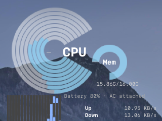

# Geektool-Sytem-Performance-Graph

Standalone GeekTool web widget project for:

- CPU ring graph
- Memory ring graph
- Network mini bar graphs
- Battery status

This project is intentionally separated from `Geektool-System-Perfomance-geeklet`.

## Preview



## Requirements

- macOS
- Homebrew
- Node.js 20+ and npm
- GeekTool

## Install (simple)

```bash
mkdir -p ~/Documents/Geektool
cd ~/Documents/Geektool
if [ ! -d "Geektool-Sytem-Performance-Graph" ]; then
  git clone https://github.com/dmccullo/Geektool-Sytem-Performance-Graph.git
fi
cd Geektool-Sytem-Performance-Graph
./install.sh
```

This setup script:

- verifies macOS + Homebrew
- installs Node.js/npm if missing
- installs `osx-cpu-temp` (optional CPU temp fallback)
- runs `npm install`

You can also run:

```bash
npm run setup
```

## Run

```bash
npm start
```

Then point a GeekTool **Web** geeklet to:

```text
http://127.0.0.1:26498
```

## Notes

- CPU temp is best-effort:
  - Uses `systeminformation` first.
  - Falls back to `osx-cpu-temp` on macOS if available.
- If no valid temp is available, it stays hidden.
- Server listens on `127.0.0.1:26498` by default.

## License

MIT
